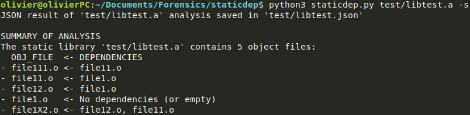
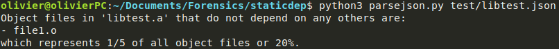
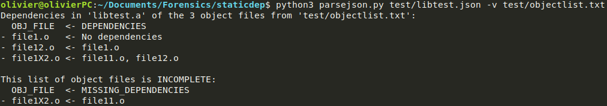

# staticdep

**staticdep** is a python tool to compute the dependencies among object files of a static library (.a). It has been created for the Forensics course at [EURECOM](http://www.eurecom.fr/en) during May 2018.

## Contents

- [Installation](#installation)
- [Usage](#usage)
    - [Analysis](#analysis)
    - [Parsing](#parsing)
- [JSON result](#json-result)
- [Examples](#examples)

## Installation

Clone this repository wherever you want:
```sh
git clone https://github.com/ojroques/staticdep.git
```
## Usage

There are two python scripts:
- **staticdep.py**: analyze a static library and save the result into a JSON file
- **parsejson.py**: parse the JSON analysis result and print useful information

To get help, you can use the option `-h`:
- `python3 staticdep.py -h`
- `python3 parsejson.py -h`

Note that those two tools have been implemented using **python 3.6** on a Linux machine. Tests show that they run fine with python 2.7 but you should favor python 3+ anyway.

#### Analysis

* To run the analysis on a static library `libfoo.a` (result saved as `libfoo.json` where `libfoo.a` is located by default):
```sh
python3 staticdep.py libfoo.a
```
* You can specify the output file with option `-o`:
```sh
python3 staticdep.py libfoo.a -o foo.json
```
* A summary of the dependencies is printed when option `-s` is set:
```sh
python3 staticdep.py libfoo.a -s
```

#### Parsing

* By default, this tool prints object files listed in the static library that do not depend on any others. If analysis result is stored in `libfoo.json`:
```sh
python3 parsejson.py libfoo.json
```
* You can also verify that a list of object files (in a separate txt file, one filename per line) is complete *i.e.* that there are no missing dependencies:
```sh
python3 parsejson.py libfoo.json -v object_list
```

## JSON result
Here is a sample of a JSON analysis result:
```json
{
    "slib_analysis": true,
    "Static library": "libtest.a",
    "Content": {
        "file111.o": {
            "Dependencies": [
                "file11.o"
            ],
            "Defined symbols": [
                "printGreetings"
            ],
            "Unresolved local symbols": [
                {
                    "printName": "file11.o"
                }
            ],
            "Unresolved global symbols": [
                "GLOBAL_OFFSET_TABLE",
                "puts"
            ]
        },
        "file11.o": {
        }
    }
}
```

It contains 3 main fields:
* `slib_analysis` is there to indicate that this file is the result of an analysis from `staticdep.py`
* `Static library` holds the name of the static library that has been analyzed
* `Content` lists each object file present in the static library

Then in `Content`, for each object file `foo.o`:
* `Dependencies` is the list of object files from which `foo.o` depends on
* `Defined symbols` is the list of symbols defined in `foo.o`
* `Unresolved local symbols` lists symbols that are not defined in `foo.o` but are present in other object files from the static library
* `Unresolved global symbols` lists symbols that are not defined in `foo.o` nor in other object files from the static library

## Examples
A static library to test the tools is present in *test/*. It contains 5 object files:
* `file1.o` has no dependency
* `file11.o` and `file12.o` both depend on `file1.o`
* `file111.o` depends on `file11.o`
* `file1X2.o` depends on `file11.o` and `file12.o`

You can use the bash script `test/runtest.sh` to test all options at once. Below are some screenshots of the results.

#### Summary of analysis

#### List of independent object files

#### Verify that a list of object files is complete

